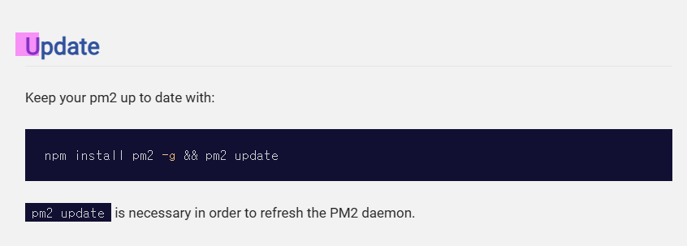

# vue-note-app

This template should help get you started developing with Vue 3 in Vite.

## Recommended IDE Setup

[VSCode](https://code.visualstudio.com/) + [Volar](https://marketplace.visualstudio.com/items?itemName=Vue.volar) (and disable Vetur).

## Customize configuration

See [Vite Configuration Reference](https://vite.dev/config/).

## Project Setup

```sh
npm install
```

### Compile and Hot-Reload for Development

```sh
npm run dev
```

### Compile and Minify for Production

```sh
npm run build
```

### now status

# 로컬 추가 영역 1111

git merge test 용 1111

```sh
npm run build
```

[동영상]https://youtu.be/IieCni_eOSc

### 따라하기

> Build a taking note app with Vue 3 and composition API

> https://www.youtube.com/watch?v=L5Jito_c0yU&t=658s"

# vue-note-app 시작

### 컴포넌트 조립

> [컴포넌트 사용 예시 1] template에 import 한 컴포넌트(HelloWorld.vue)를 template에 추가한다.
> [컴포넌트 사용 예시 1] 추가할때 추가할 컴포넌트(HelloWorld.vue)에 props > msg 를 선언하고 값을 세팅하여 컴포넌트에서 defineProps로 msg를 정의하고 사용한다
> 

- [컴포넌트 사용 예시 2] template에 import 한 컴포넌트(TheWelcome)를 template에 추가한다.
- [컴포넌트 사용 예시 2] import 한 컴포넌트(TheWelcome) 안에서 컴포넌트(WelcomeItem)를 import 하여 를 template에 추가한다.
- [컴포넌트 사용 예시 2] 추가할때 추가할 컴포넌트(WelcomeItem.vue) 영역에 3가지 영역으로 처리한다

```html
<template #icon><DocumentationIcon /></template>

<template #heading>Documentation</template>

text 영역
```

> 위 3가지 영역 값은 3가지 slot에 매핑된다.

- 
- 
- 

# auto format set


# 따라하기 완료 한 개발 화면 동영상

https://www.youtube.com/watch?v=YLFQFqD7o7k

# 저장시 자동 포맷팅


# 로컬 추가 영역 2222

git merge test 용 2222

# dev9 브랜치에서 추가함

# 앞으로 이 프로젝트에서 할일

# 배포 자동화

- ubuntu24.04

  - docker or microk8s
  - ci/cd - jenkins
  - db server - postgres
  - web server - nginx

# vscode

C:\app\vue\vue-note-app>cd /app

C:\app>cd vue\vue-note-app

C:\app\vue\vue-note-app>code .

C:\app\vue\vue-note-app>

# jenkins set

    https://jenkins.dev9.store/job/vue-note-app/

  <pre>
  pipeline {
      agent any
      stages {
          stage('Prepare branch github_access_token url') {
              agent any
              steps {
                  git branch: 'main', 
                  credentialsId: '43134ce5-9160-45f6-b3b9-723105d81532', 
                  url: 'https://github.com/sangbinlee/vue-note-app.git'
              }
              post {
                  failure{
                      error "Fail Cloned Repository"
                  }
              }
          }
      }
  }    
  
  </pre>

https://jenkins.dev9.store/manage/credentials/store/system/domain/_/
https://jenkins.dev9.store/manage/credentials/store/system/domain/_/credential/43134ce5-9160-45f6-b3b9-723105d81532/


# webhook test

# webhook test

# 우분투 타임존 변경

    sangbinlee9@dev9-ubuntu24-1:/etc$ timedatectl
                Local time: Sat 2024-12-07 02:48:53 UTC
            Universal time: Sat 2024-12-07 02:48:53 UTC
                    RTC time: Sat 2024-12-07 02:48:53
                    Time zone: Etc/UTC (UTC, +0000)
    System clock synchronized: yes
                NTP service: active
            RTC in local TZ: no
    sangbinlee9@dev9-ubuntu24-1:/etc$ timedatectl list-timezones | grep Seoul
    Asia/Seoul
    sangbinlee9@dev9-ubuntu24-1:/etc$ sudo timedatectl set-timezone Asia/Seoul
    [sudo] password for sangbinlee9:
    sangbinlee9@dev9-ubuntu24-1:/etc$ timedatectl
                Local time: Sat 2024-12-07 11:49:44 KST
            Universal time: Sat 2024-12-07 02:49:44 UTC
                    RTC time: Sat 2024-12-07 02:49:44
                    Time zone: Asia/Seoul (KST, +0900)
    System clock synchronized: yes
                NTP service: active
            RTC in local TZ: no
    sangbinlee9@dev9-ubuntu24-1:/etc$


    sangbinlee9@dev9-ubuntu24-1:/etc$ date
    Sat Dec  7 11:50:12 AM KST 2024
    sangbinlee9@dev9-ubuntu24-1:/etc$

# jenkins timezone 변경 하기


    https://www.jenkins.io/doc/book/managing/change-system-timezone/


# webhook


# vue3.dev9.store

root@dev9-ubuntu24-1:/etc/nginx/sites-available# cp api.dev9.store vue3.dev9.store
root@dev9-ubuntu24-1:/etc/nginx/sites-available# vi vue3.dev9.store
root@dev9-ubuntu24-1:/etc/nginx/sites-available# nginx -t
nginx: the configuration file /etc/nginx/nginx.conf syntax is ok
nginx: configuration file /etc/nginx/nginx.conf test is successful
root@dev9-ubuntu24-1:/etc/nginx/sites-available# cat vue3.dev9.store

# Default server configuration

server {

          server_name vue3.dev9.store;

          location / {
                  proxy_set_header Host $host;
                  proxy_set_header X-Real-IP $remote_addr;
                  #proxy_set_header X-Forwarded-For $proxy_add_x_forwarded_for;
                  #proxy_set_header X-Forwarded-Proto $scheme;
                  proxy_pass http://localhost:3001;
          }

}

server {
if ($host = vue3.dev9.store) {
                  return 301 https://$host$request_uri;
} # managed by Certbot

          listen 80 ;
          listen [::]:80 ;

          server_name vue3.dev9.store;
          return 404; # managed by Certbot

}

root@dev9-ubuntu24-1:/etc/nginx/sites-available# ls -s /etc/nginx/sites-available/vue3.dev9.store /etc/ngi nx/sites-enabled/
4 /etc/nginx/sites-available/vue3.dev9.store

/etc/nginx/sites-enabled/:
total 0
0 api.dev9.store 0 default 0 dev9.store 0 jenkins.dev9.store
root@dev9-ubuntu24-1:/etc/nginx/sites-available# ln -s /etc/nginx/sites-available/vue3.dev9.store /etc/ngi nx/sites-enabled/
root@dev9-ubuntu24-1:/etc/nginx/sites-available# ls -s
total 20
4 api.dev9.store 4 default 4 dev9.store 4 jenkins.dev9.store 4 vue3.dev9.store
root@dev9-ubuntu24-1:/etc/nginx/sites-available# ll
total 28
drwxr-xr-x 2 root root 4096 Dec 7 22:08 ./
drwxr-xr-x 8 root root 4096 Dec 7 21:48 ../
-rw-r--r-- 1 root root 899 Dec 7 21:53 api.dev9.store
-rw-r--r-- 1 root root 2412 Dec 1 2023 default
-rw-r--r-- 1 root root 1171 Nov 25 04:52 dev9.store
-rw-r--r-- 1 root root 817 Nov 25 05:29 jenkins.dev9.store
-rw-r--r-- 1 root root 521 Dec 7 22:08 vue3.dev9.store
root@dev9-ubuntu24-1:/etc/nginx/sites-available# service nginx restart
root@dev9-ubuntu24-1:/etc/nginx/sites-available# certbot --nginx -d vue3.dev9.store
Saving debug log to /var/log/letsencrypt/letsencrypt.log
Requesting a certificate for vue3.dev9.store

Successfully received certificate.
Certificate is saved at: /etc/letsencrypt/live/vue3.dev9.store/fullchain.pem
Key is saved at: /etc/letsencrypt/live/vue3.dev9.store/privkey.pem
This certificate expires on 2025-03-07.
These files will be updated when the certificate renews.
Certbot has set up a scheduled task to automatically renew this certificate in the background.

Deploying certificate
Successfully deployed certificate for vue3.dev9.store to /etc/nginx/sites-enabled/vue3.dev9.store
Congratulations! You have successfully enabled HTTPS on https://vue3.dev9.store

---

If you like Certbot, please consider supporting our work by:

- Donating to ISRG / Let's Encrypt: https://letsencrypt.org/donate
- Donating to EFF: https://eff.org/donate-le

---

root@dev9-ubuntu24-1:/etc/nginx/sites-available# cat vue3.dev9.store

# Default server configuration

server {

          server_name vue3.dev9.store;

          location / {
                  proxy_set_header Host $host;
                  proxy_set_header X-Real-IP $remote_addr;
                  #proxy_set_header X-Forwarded-For $proxy_add_x_forwarded_for;
                  #proxy_set_header X-Forwarded-Proto $scheme;
                  proxy_pass http://localhost:3001;
          }


      listen 443 ssl; # managed by Certbot
      ssl_certificate /etc/letsencrypt/live/vue3.dev9.store/fullchain.pem; # managed by Certbot
      ssl_certificate_key /etc/letsencrypt/live/vue3.dev9.store/privkey.pem; # managed by Certbot
      include /etc/letsencrypt/options-ssl-nginx.conf; # managed by Certbot
      ssl_dhparam /etc/letsencrypt/ssl-dhparams.pem; # managed by Certbot

}

server {
if ($host = vue3.dev9.store) {
                  return 301 https://$host$request_uri;
} # managed by Certbot

          listen 80 ;
          listen [::]:80 ;

          server_name vue3.dev9.store;
          return 404; # managed by Certbot

}

server {
if ($host = vue3.dev9.store) {
          return 301 https://$host$request_uri;
} # managed by Certbot

          server_name vue3.dev9.store;
      listen 80;
      return 404; # managed by Certbot

root@dev9-ubuntu24-1:/etc/nginx/sites-available#

# jenkins config


## npm: not found

    npm install

    

## npm: not found

echo ■ npm install
■ npm install
npm install
/var/lib/jenkins/workspace/vue-note-app@tmp/durable-fb04e966/script.sh.copy: 5: npm: not found


## jenkins job never ending....




pm2 logs
